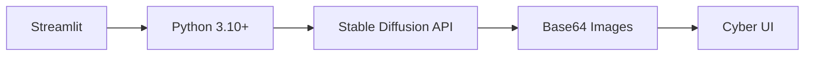

# ⚡ CYBER IMAGE GENERATOR


> *"Conjure digital visions from the void"* - Um gerador de imagens por IA com interface cyberpunk

## 🌌 Visão Geral

Um aplicativo web futurista que utiliza modelos de IA de última geração para gerar imagens impressionantes baseadas em suas descrições. Com uma interface inspirada em terminais cyberpunk, oferece controle total sobre o processo de geração.

```ascii
  _____________________________
 /                            \
|    CONECTANDO AO NEURAL NET   |
 \__  _______________________  /
    \/                      \/
    /\    CYBER IMAGERY      /\
   /  \    GENERATOR 3000   /  \
  /____\___________________/____\
```

## ✨ Funcionalidades

- 🖼️ Geração de imagens por IA (Stable Diffusion v1.6, v2.1, XL)
- ⚙️ Controles avançados de geração (CFG scale, steps, resolução)
- 💾 Download direto das imagens geradas
- 🎨 Interface dark tech com efeitos neon
- 📱 Layout responsivo para qualquer dispositivo

## 🛠️ Tecnologias



## 🚀 Como Usar

1. **Instalação**:
   ```bash
   git clone https://github.com/seu-usuario/cyber-image-generator.git
   cd cyber-image-generator
   pip install -r requirements.txt
   ```

2. **Configuração**:
   - Adicione sua API key no arquivo `config.py`
   - Personalize as opções em `settings.ini`

3. **Execução**:
   ```bash
   streamlit run main.py
   ```

4. **Geração**:
   ```python
   # No terminal cybernético:
   > DESCRIÇÃO: "Um androide com olhos brilhantes em uma cidade futurista"
   > ESTILO: "cyberpunk, neon lights, 4k detailed"
   > [INICIAR GERADOR QUÂNTICO]
   ```

## 📸 Capturas de Tela

| Painel de Controle | Saída de Imagem |
|---------------------|-----------------|
|  |  |

## 🌐 Deploy

Implante facilmente em:

[](https://heroku.com/deploy)
[](https://replit.com/github/seu-usuario/cyber-image-generator)
